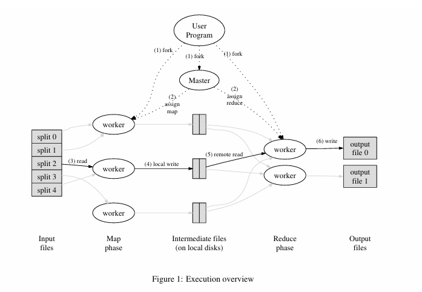

# 第一节

## 论文部分:MapReduce: Simplified Data Processing on Large Cluster

### 主体思想:
1. Map(映射): 把大数据拆成小块，然后交给集群，并行处理，每个单体产出初步结果(即中间层键值对)
2. Shuffle(洗牌): 把上一步所产生的初步结果分组整理
3. Reduce(归纳): 把分组好的数据汇总，统计，输出结果

``` python

Map(String key, String value):
    for w in value: # 拆分小块
        EmitIntermediate(w,'1'); # 处理，产出中间层键值对

Reduce(String key, Iterators values):
    result = 0
    for v in values:
        result += isTargetOrNot(v) # 这个函数只返回0或者1
    Emit(str(result))

```

### 实现方案



具体步骤:

1. 首先将文件分割为M个部分
2. 主节点分配workers，分配workers去负责M个map任务和一部分workers负责R个Reduce任务，注意，M,R,处理Map任务的集群个体和Reduce任务的集群个体这四个参数并强制不相等。
3. 负责map的worker生成中间键值对，保存在内存中
4. 内存内容定期写入本地磁盘，然后分成R个区域，转发给Reduce的worker
5. Reduce的workers根据中间键值对汇总归约，不断追加到输出文件中
6. 当Map和Reduce都完成后，主节点唤醒用户程序

### 内容细节:

#### 主控的数据结构:
1. 首先存储每个map任务和reduce任务的状态以及工作机器的标识
2. 存储R个中间文件区域和大小，后续逐个推送给Reduce的工作节点

#### 容错机制:

##### 对于工作节点故障:

主节点会向工作节点定期发送心跳检测，如果未收到相应，则标记为故障。

对于已经完成的*映射*内容则会重置为初状态然后重新调度到其他工作节点进行操作。对于正在执行的的*映射*和*归约*工作都会被重置。

已完成映射任务需要重新执⾏是因为其输出结果存储在故障机器的本地磁盘上，因此无法访问。⽽已完成的归约任务无需重新执⾏，因为其输出存储在全局文件系统中。

A被标记为故障后由B进行后续的工作，所有reduce工作的worker都会收到重新执行的通知，然后任何未从worker A中读取数据的reduce工作都会从worker B读取数据。

##### 对于主节点故障:

从最近的检查点启动新副本。由于其唯一性，所以出错的概率极小，出现故障则直接中止MapReduce工作。

##### 故障下的语义保证:

无论是否有故障，由于map和reduce函数结果的确定性，得到的结果输出完全一致。

#### 局部性:

在论文中给定的计算环境中，网络是相对稀缺的资源，所以使用存储在集群机器本地来节省网络带宽。GFS将文件分割为64MB的块并在不同的集群机器个体上保存副本(一般是3个)，由主点位考虑位置问题。若⽆法实现，则会尝试在靠近该任务输⼊数据副本的位置调度映射任务。当集群中大部分个体在运行大规模的MapReduce时，多数数据可以实现本地读取，完全不消耗网络带宽。

#### 任务颗粒:

M个Map任务和R个Reduce任务可以大于处理Map任务和Reduce任务的集群个体的数量。让每个⼯作节点执⾏多个不同任务有助于实现动态负载均衡，同时能加速⼯作节点故障时的恢复过程。

实践中，我们倾向于选择 M值使得每个独⽴任务处理约 16MB 到 64MB 的输⼊数据（这样上述的本地化优化效果最佳），并将 R 值设为我们预期使⽤的 worker 机器数量的较⼩倍数。我们经常使⽤M=200,000 和 R=5,000 的参数进⾏ MapReduce 计算，并配备 2,000 台 worker 机器。

#### 备份任务:

当最慢的那个集群个体拖慢整体完成进度时，会调用已结束的空闲集群个体去分担任务，缩短MapReduce的结束时间。

### 功能优化: 一系列增强功能和优化机制

1. 分区函数: 默认情况下，MapReduce 使用哈希函数（如 hash(key) mod R）将中间键分配到 R 个 reduce 任务中。实际开发中可以自定义分区函数
2. 顺序保证: 保证每个分区内的中间键值对是按键的升序处理的，这使得每个 reduce 分区的输出文件是按键排序的，便于后续的随机访问或合并。
3. 合并函数: Map函数结束后到网络传输前可以使用conbiner函数对本地结果合并，减少网络传输量。Combiner 通常与 Reduce 函数使用相同的代码。
4. 输入输出类型: 支持多种输入输出格式，可以通过reader接口自定义输入源。
5. 副作用处理: 允许用户在执行过程中生成辅助文件(如日志、临时文件)。
6. 跳过错误记录: 自动记录错误，然后重试时跳过错误，如果多次遇到该错误，则会直接标记为可以跳过
7. 本地执行模式: 支持在单机上顺序执行整个 MapReduce 作业，便于调试、性能分析和单元测试
8. 状态信息: 主节点运⾏⼀个内部 HTTP 服务器，并提供⼀组状态⻚⾯供⼈⼯查看。顶层状态⻚⾯会显⽰哪些⼯作节点发⽣故障，以及它们在故障时正在处理哪些映射和归约任务
9. 计数器: 提供计数器机制，允许用户在 Map 或 Reduce 函数中自定义计数事件（如处理了多少个单词、多少德语文档等）。计数器值会定期从 Worker 发送到 Master，进行聚合，并在状态页面上显示。可用于数据校验和合理性检验。

### 性能表现:

#### Grep测试:

任务: 在1e10的100byte的记录中，搜索罕见的三个字母的特定模式。

结果: ⼤约需要 150 秒，其中包括约 1 分钟的启动开销。

#### Sort测试

任务: 对同样1TB的数据（100亿条记录）进行排序

结果: 891秒结束任务。

过程分析：

论文里用图表详细展示了排序过程中的三个关键阶段：

1. 读取输入数据: 速度很快（峰值约13 GB/s），MapReduce会优先让存有数据的机器自己处理数据（本地化优化），减少网络传输。
2. 混洗(Shuffle): 这是Map阶段完成后，将中间结果通过网络发送给Reduce任务的过程。这是整个流程中最耗网络资源的阶段。
3. 最终结果: Reduce任务对收到的数据排序后，将最终结果写入分布式文件系统。因为为了保证数据安全，写了两个副本，所以写入数据量是实际输出的两倍。

重点结果:

1. 关掉备份任务功能后，由于几个慢速的集群个体，导致总完成时间增加44%
2. 任务中途关掉了200个工作进程来模拟机器故障，MapReduce系统自动在别的集群个体上重新执行任务，整个作业完成时间只比正常情况多5%。体现出MapReduce的较强的容错能力。

## 课程部分: Lec 1

课程部分似乎就是把论文讲了一下，如果论文看的比较精细的话，似乎课程内容没有太多新的东西。

### 重点设计:

RPC, Threads, Lock

### 分布式设计的三个指标

可拓展性，可用性，一致性。

可拓展性: 增加设备就能提高整体处理性能的能力

可用性: 在特定的故障范围内，系统仍能恢复并继续提供服务

一致性: 主要指存储内容的读取结果一致

