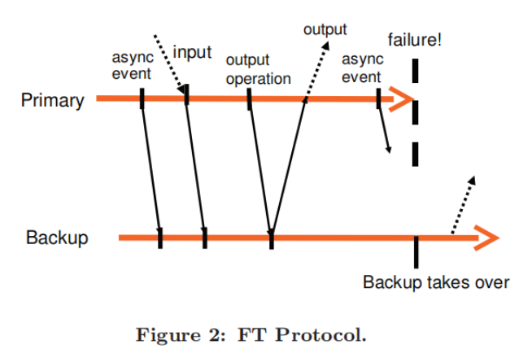

# Lec3

## VM-FT(Fault Tolerence)论文部分

### 主体思想

1. 主体VM和备份VM运行在不同的物理服务器上
2. 虚拟磁盘使用共享内存部分，主备VM都可以使用、访问
3. 只有主VM产生实际输出，并被返回给客户端

### 基本的FT设计

#### 确定性重放: 记录并复现某一程序(或者整个虚拟机)的精确执行过程。

1. 确定性重放的核心思想:如果一个系统从完全相同的初始状态开始，并且以完全相同的顺序接收完全相同的输入，那么它的执行路径和最终状态也将是完全相同的。
2. VMware确定性重放不需要使用epochs。 每次中断在发生时被记录，并且在重放时有效地传递到适当的指令处。

#### FT协议: 
1. 作用: 日志通道中使用严格的 FT 协议以增强日志条目，从而确保我们实现故障容忍
2. 输出规则: 主VM在输出之前，必须等待备用VM的确认收到了与产生该输出的操作相关的日志条目
3. 工作流程: 主VM先执行一个要输出的指令，然后阻塞，产生一个日志条目，通过日志通道发送给备用VM，但是主VM的计算和执行仍然可以进行，减少性能损耗，备用VM收到条目后存入缓存区，并立即发送一个Acknowledgment给主VM，主VM收到后解除阻塞，继续执行输出。
4. 关键组成部分: 日志通道管理协议，故障检测与仲裁协议(UDP心跳检测，脑裂问题的原子性检验)，控制操作传播协议(对于用户的管理操作（如关机、重启、调整CPU资源），这些操作只在主VM上发起。然后通过日志通道发送一个特殊的控制日志条目（Control Log Entry） 给备份VM，确保备份VM能执行相同的操作，保持状态一致。)
5. 图例: 
   
### FT的实际执行

本部分内容主要介绍了如何将第二部分这个理论上可行的容错协议转化为一个稳定、高效、自动化、可商用的完整系统。

#### 启动与重启vm-ft

目标: 启动一个拥有与主机状态一致的备份VM，故障发生后重启一个VM，并且可以用于任一状态，不会显著中断主VM的执行

解决方案: 对标准 VMotion 进行了修改，允许以最少中断的方式，将正在运行的 VM 从一台服务器迁移到另一台服务器，VM的暂停时间通常不到一秒钟。 FT VMotion 是在主机B上创建一个精确的副本，但同时不销毁主机A上的原始VM

过程: FT VMotion 会将主VM的内存、寄存器状态等快速拷贝到另一台主机，并在此过程中短暂暂停主VM（通常<1秒）。完成后，主VM继续运行，新创建的副本则成为它的备份VM，并立即建立日志通道开始同步。当出现故障时，集群会自动选出新的主VM代替，并自动发起FT VMotion来创建新的VMotion备份。

#### 管理日志通道

在实现中，管理程序为主备VM的日志记录条目提供了一个缓冲区，Log Buffer。

意外情况: 主VM的运行速度与备份VM的速度不匹配可能导致备份VM的执行慢于主VM，从而导致log buffer填满，为了避免意外暂停所采用的机制为 **如果备份 VM 有一个显著的执行滞后（例如，超过 1 秒），VMware FT 通过通知调度程序给它稍微少一点的CPU（最初只是百分之几）来减慢主 VM**

PS: 主VM的这种减速很少见，通常只在系统处于低压力时发生

#### 磁盘IO的实现问题

在实现中，并行、同时执行的磁盘操作将引起非确定性，同时访问相同内存页的磁盘操作也可能导致不确定性，磁盘操作与内存访问也会存在竞争。主VM未完成的磁盘IO相关的问题。

解决方案: 检测并强制对访问同一磁盘位置或内存页的并行IO操作顺序执行，消除竞争。同时还会生成一个bouncy buffer中转磁盘和读写，最后同步到内存。对于主VM没完成的IO相关的问题，新的主VM会重新发出所有未完成的IO。因为IO是幂等的（例如，对同一个磁盘块写入相同的数据两次是安全的），所以这不会造成问题。

#### 网络IO的实现问题

问题在于，Hypervisor通常使用异步优化来提升网络性能，但这些优化会引入非确定性，如何在不牺牲太多性能的前提下保证确定性。

解决方案是，关闭会异步更新VM网络设备状态的高性能优化。注册回调函数，在收到日志或ACK时，在中断上下文中直接处理，避免昂贵的线程调度，极大降低了输出延迟。

### 代替设计

#### 共享磁盘 vs. 非共享磁盘 

首先，共享磁盘是默认选择。

1. 共享磁盘: 主VM和备份VM连接并读写同一个虚拟磁盘文件，该文件位于共享存储上。
   1. 优点: 恢复快，简单可靠
   2. 缺点: 必须保证同时可以访问磁盘
2. 非共享磁盘: 主VM和备份VM各有自己独立的虚拟磁盘。主VM写入自己的磁盘，同时，磁盘写入的内容也会被记录下来，并通过日志通道发送给备份VM，备份VM会将这些写入操作应用到自己的磁盘上。
   1. 优点: 无需共享存储，降低了成本和架构复杂度。使得长距离容错成为可能，因为主备VM可以分布在两个不同城市的数据中心，使用本地存储。
   2. 缺点: 复杂度更高，而且脑裂仲裁更加复杂。
   
#### 在备份VM上执行磁盘读取

在默认的设计中，备份的VM从不会从它自己的虚拟磁盘上读取。

1. 默认设计：不执行读取，日志传送数据
   1. 磁盘读取被视作一种输入。当主VM执行磁盘读取时，它从磁盘获取数据，并将该数据本身作为日志条目发送给备份VM。备份VM直接使用日志中的数据，自己不去读磁盘。
   2. 优点: 确定性保证，性能可能更优
   3. 缺点: 日志带宽高
2. 备份VM执行磁盘读取: 
   1. 主VM执行磁盘读取时，只记录一个“发生了读取操作”的日志事件，不发送数据。备份VM在执行到该点时，自己发起相同的磁盘读取操作来获取数据。
   2. 优点: 降低日志宽带。
   3. 缺点: 性能不一致，读取结果失败，依赖关系