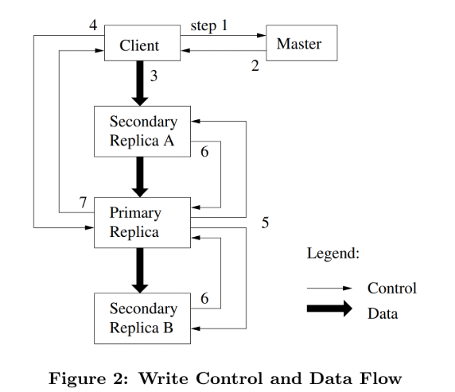

# Lec4 & GFS 

## 论文部分: GFS

### GFS介绍

GFS是一个大型的分布式文件系统，主要目的是在大量廉价商用设备上满足存储需求。

### GFS设计

#### 接口

基本操作: create, delete, open, close, read, write

两个关键操作:
1. 快照(SnapShot): 以低成本创建文件或目录树的副本
2. 记录追加(Record Append): 它允许多个客户端并发地、原子地向同一个文件追加数据，而无需它们之间进行复杂的同步

#### 架构

三个主要组成部分:
1. Master: 管理所有文件系统元数据，协调系统活动(块租约管理、垃圾回收、块迁移等)，定期心跳连接检测ChunkServer是否存活。但是客户端从不通过Master读写文件数据，Master只提供元数据，以避免成为瓶颈。
2. ChunkServer: 将每个块（Chunk）作为一个普通的Linux文件存储在本地磁盘上，默认情况下，每个块会在多个不同的Chunkserver（跨机架） 上存储3个副本。
3. Client: 实现文件系统API，与Master交互进行元数据操作，直接从Chunkserver读写数据

一个简单的读取流程: 
1. Client将(文件名, 字节偏移)转换为(文件名, 块索引)。
2. Client向Master询问该块所在的Chunkserver。
3. Master回复该块的句柄和所有副本的位置。
4. Client缓存这些信息。
5. Client从最近的一个副本（通常是其中之一）请求数据，指定(块句柄, 字节范围)。
6. Chunkserver将数据返回给客户端。

#### 单Master设计

只设计了一个Master，同时只存储元数据，包含文件相关的内容，但是不包含文件本身的内容。最小化master节点在读写中的参与，以避免其成为系统瓶颈。

#### Chunk大小

一般设置为64MB，其远大于通常的文件系统的块大小。

对于超出64MB的文件，GFS会自动将该文件分割成多个chunk进行存储。GFS客户端库在收到应用程序的写入请求时，会根据固定的64MB chunk大小，将文件在逻辑上划分为一个连续的chunk序列。当需要读写某个特定偏移量的数据时，客户端会通过一个简单的计算将(文件名, 字节偏移量)转换为(文件名, chunk索引)。例如，一个128MB的文件会被分割为chunk 0（0-64MB）和chunk 1（64MB-128MB）。

Master如何管理多chunk文件？

Master在内存中维护着文件到chunk的映射关系。这个映射通常是一个列表或数组，记录着：

文件/data/largefile.log

对应 chunk 句柄列表: [chunk_handle_123, chunk_handle_456, chunk_handle_789, ...]

每个chunk句柄都指向一组存储该chunk副本的Chunkserver地址。

写入流程（以一个大文件的连续写入为例）：

1. 客户端告诉Master要写入文件/data/largefile.log的起始位置。
2. Master查看该文件的chunk映射列表。
3. 如果写入操作覆盖了最后一个chunk的一部分，Master会将该chunk的租约授予一个Primary Chunkserver。
4. 如果写入操作超出了最后一个chunk的末尾，Master会创建一个新的chunk，将其添加到文件的chunk列表中，并为这个新chunk选择初始的副本位置，然后授予租约。
5. 客户端从Master获取到当前应该写入的chunk（可能是最后一个chunk或一个新chunk）的Primary和Secondary副本的位置。
6. 客户端开始向这个chunk的所有副本推送数据。当这个chunk被写满（接近64MB）后，流程重复：客户端联系Master，Master分配下一个新chunk，如此往复，直到所有数据写完。

读取流程：

1. 客户端想读取文件/data/largefile.log中从偏移量70MB开始的1MB数据。
2. 客户端进行计算：chunk_index = (70MB / 64MB) = 1（索引从0开始）。要读取的数据在这个chunk内的偏移量是 70MB - 1*64MB = 6MB。
3. 客户端向Master询问文件/data/largefile.log的第1号chunk的位置信息。
4. Master回复chunk句柄和所有副本的位置。
5. 客户端联系其中一个副本（通常是最近的），请求读取chunk句柄对应的chunk中从6MB开始到7MB结束的数据。

不是所有文件的大小都正好是64MB的整数倍。因此，文件的最后一个chunk通常是不满的。GFS对此有高效的处理：

惰性空间分配：每个chunk在Chunkserver上最初只是一个空文件。它只在数据被实际写入时才会分配磁盘空间。这意味着一个32MB的文件只占用32MB的物理磁盘空间，而不是64MB，避免了内部碎片化浪费。

精确记录大小：Master的元数据中会记录每个chunk的实际大小。客户端读取最后一个chunk时，Chunkserver只会返回有效范围内的数据，不会返回未写入的“垃圾”数据。

#### 元数据

master主要存储三种元数据：文件和chunk的命名空间（namespace）、文件到chunk的映射和chunk的每个副本的位置

前两种元数据通过操作日志（Operation Log） 持久化到磁盘并复制到远程机器。

块的位置信息不持久化。Master在启动时或Chunkserver加入时通过询问Chunkserver来获取这些信息。这简化了设计，避免了Master和Chunkserver之间的状态同步问题。

#### 一致性模型

所有客户端无论从哪个副本读取，看到的数据都是一样的。

### 系统交互

#### 租约和变更顺序

在对元数据进行修改时，每个副本都会收到影响而修改，这种修改的一致性是通过租约(Lease)来实现的。这种租约机制是为了最小化master管理负载而设计的。租约的最初超时时长为60s，但是chunk一旦被变更，primary会向master请求延长租约的超时时间，然后接受master的超时授权。这些延长请求和授权请求依赖master与chunkserver间周期性地心跳消息来实现。

具体过程是首先Master向一个副本授予权限，进行变更(或者说授权一个变更的租约)，这个副本被称为Primary，然后primary会为所有的修改提供一个顺序。所有副本都会按照这个顺序来应用变更。

如果应用程序发出的一次write请求过大或跨多个chunk，GFS的client代码会将其拆分成多个write操作。

对于一次write流程:
1. client向master询问哪个chunkserver持有指定chunk的租约及该chunk的其他副本的位置。如果没有chunkServer持有租约，则master会对一个副本进行授权
2. master回复primary副本的标识符和其他副本（也称secondary）的位置。client将这些信息缓存。只有当client无法访问primary的时候才会和master再次通信。
3. client将数据按照任意chunk的顺序推送到所有副本。
4. 一旦所有副本都确认收到了数据，client会向primary发送一个write请求。primary会为其收到的所有的变更（可能来自多个client）分配连续的编号
5. primary将write请求继续传递给其他secondary副本。每个secondary副本都按照primary分配的顺序来应用变更。
6. 所有的secondary副本通知primary其完成了变更操作。
7. primary回复client。任意副本遇到的任何错误都会被报告给client。只要有一个副本错误发生，该请求都会被认为是失败的，且被修改的区域的状态为inconsistent。client中的代码会通过重试失败的变更来处理这种错误。首先它会重试几次步骤（3）到步骤（7），如果还没有成功，再从write请求的初始操作开始重试。

#### 数据流

为了充分利用机器的网络带宽，数据会沿着chunkserver链线性地推送，而不是通过其他拓扑结构（如树等）分配发送。因此，每台机器全部的出口带宽都被用来尽可能快地传输数据，而不是非给多个接受者。

为了尽可能地避免网络瓶颈和高延迟的数据链路。每台机器会将数据传递给在网络拓扑中最近的的且还没有收到数据的机器。

通过流水线的方式通过TCP连接传输数据，以最小化时延。当chunkserver收到一部分数据时，它会立刻开始将数据传递给其他chunkserver。因为我们使用全双工的交换网络，所以流水线可以大幅减少时延。发送数据不会减少接受数据的速度。

#### 原子性

原子记录追加操作:记录追加 是一种特殊的写操作，客户端只提供数据，而不指定写入的偏移量。

所谓的写入的偏移量其实本质上就是一个地址，用来指明数据在文件中的起始位置。对于原子记录追加操作，GFS 主节点 选择并返回偏移量，客户端不指定。

#### 快照

快照操作几乎会在瞬间对一个文件或一个目录树（被称为源）完成拷贝，同时能够尽可能少地打断正在执行的变更。

当master收到快照请求的时候，它首先会撤销快照涉及到的文件的chunk上所有未完成的租约。在租约被收回或过期后，master会将快照操作记录到日志中，并写入到磁盘。

当某个客户端第一次尝试写入一个已被快照的 Chunk（例如 Chunk C）时，它会联系主节点。

主节点发现 Chunk C 的引用计数大于1（即被多个文件共享），它不会直接允许写入。

主节点会暂停回复客户端，并选择一个新 Chunk 编号 C'。然后，它命令持有 Chunk C 的 chunkserver在本地磁盘上创建一个新的 Chunk C'，数据从 C 复制过来。(本地复制减少了网络传输的消耗)

客户端会向新的 Chunk C' 执行写入操作，而原始的 Chunk C 的内容保持不变，继续被快照文件所引用。