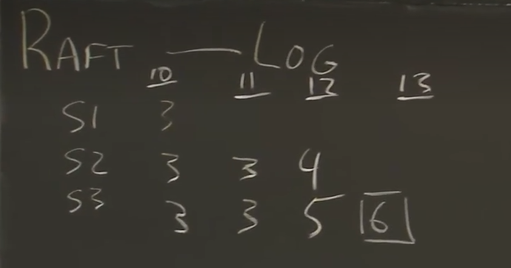
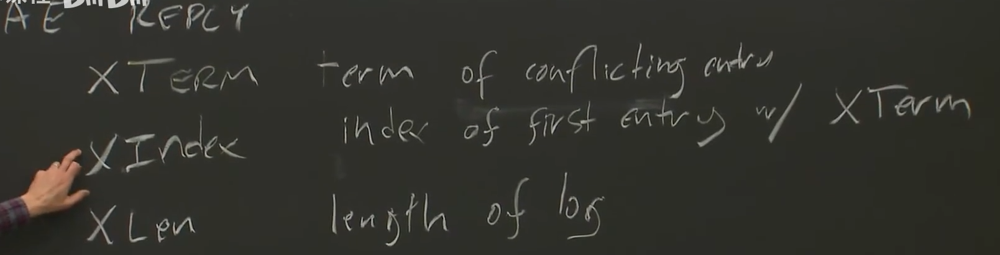
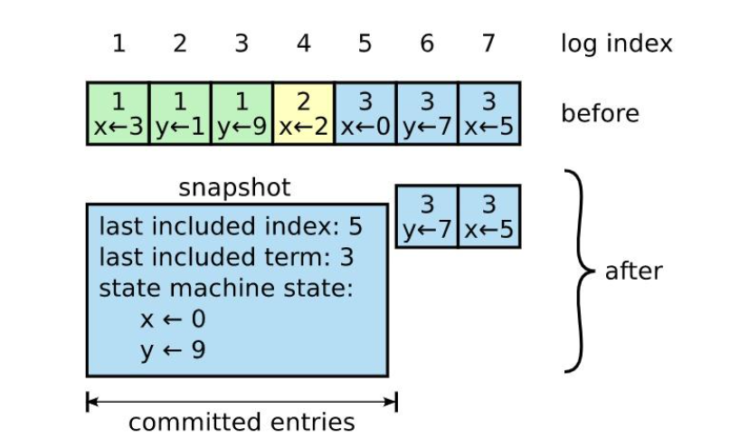

# Lec5 & Raft

## 论文部分: Raft

### Raft介绍

Raft是用来管理复制日志的共识算法。它的效果和效率与Paxos一样，但是结构不同；这使得Raft比Paxos更容易理解，同时为构建实际系统提供良好的基础。

特点: 

1. 更有权力的Leader: 日志条目只会从leader流向其他的server。
2. Leader选举: 在心跳连接的基础上加入了少量机制，来实现快速的解决问题。
3. 集群成员变化: 允许集群在配置变化时也可以正常执行。

### 复制状态机

对于复制状态机的集群而言，要想服务器集群中的状态机计算某一状态的相同副本，即使某些服务器宕机也可以继续运行，就需要共识算法。

复制状态机被用来解决一系列分布式系统的FT(Fault tolerance)问题。比较经典的案例就是vm-ft，在前面的文章中有讲过。

共识算法的任务就是保证复制日志的一致性。

用于实际应用的共识算法需要有以下特征:

1. 安全性: 不会返回错误的结果，非拜占庭条件，包括网络延迟、分片和丢包、重复。
2. 可靠性: 即使有部分服务器宕机，也可以正常运行，并且让服务器重启后可以重新加入集群。
3. 不依赖时间来保证日志一致性: 不会产生由于错误的时钟导致的可靠性问题。
4. 少数慢服务器不影响整体系统性能

### Paxos的问题:

主要就是两个问题，难理解，难实现。

Paxos的核心——单法令Paxos本身就“密集而微妙”。它被分成两个没有简单直观解释的阶段，且这两个阶段无法独立理解。

缺乏标准实现：对于如何构建多Paxos，Lamport的描述大多停留在单法令阶段，仅勾勒了可能的思路，缺乏关键细节。架构不实用，独立选择一系列日志条目，再将它们合并成一个有序日志，这增加了复杂性。领导者的作用较弱，实际操作难度更大。

### Raft共识算法:

对于Raft共识算法，它把复杂的问题分解为:Leader选举，日志复制，安全性保障三个子问题。

#### Leader选举:

首先，服务器有三种状态，Leader, Follower, Candidate 

如果 Follower 在 选举超时时间 内没有收到 Leader 的心跳，它就变成 Candidate，开始选举。follower增加它的当前任期号，然后转换为candidate状态。它为自己投票，而且给集群中所有的服务器并行发出RequestVote RPC。一个candidate继续保持它的状态直到有以下一种情况发生：
1. 它赢得了选举
2. 另一个服务器成为了leader
3. 没有leader产生

对于选举结果有以下几种情况:
1. 获得多数派投票 → 成为 Leader。
2. 发现已有 Leader：收到来自更高或相等 Term 的 AppendEntries → 退回 Follower。
3. 选举超时：无人胜出 → 增加 Term，重新开始选举。

特殊情况细节处理：只对最新Term更高的或者最新Term相同而日志长度更长的投赞同票（处理两个参与者的竞争情况）

### 日志复制:

两个entry的index和term相同的话，那么包含的command一定相同，而且之前的command也一定是相同的

关于日志复制的两个特性：
1. leader在给定的term和index上只能创建一个entry，而且entry不被允许修改位置。
2. 通过AppendEntries执行的简单一致性来保证。

对于这种情况，复制过程应该为，s3向s1，s2发送Append entries，然后检测s1，s2所拥有的最后一个提交是否和s3的相应位置的Term相同，这里是不相同的，所以把LastEntryindex向前推进，直至找到相同Term和index，同时s3将相同index后所有的entry全部发送过去。

对于日志冲突的处理的Append Entries Reply是这样设计的

XTerm 冲突的Term

Xindex 对于冲突日志的第一个index

Xlen 冲突日志的长度

可以利用这三个参数快速决定要传回哪些command

### 安全性保障：

略

### 日志压缩：

在正常运行期间，Raft的日志会不断增长，但在实际系统中，无法无限制地增长。 随着日志的增长，日志会占用更多空间，并且需要花费更多时间进行恢复。如果没有处理的话会导致可用性问题

这里使用的压缩算法是快照

这是一个简单的压缩案例，对于最后一次Append entries，记录了这次append之前所有的更改和包含的index和包含的term。

两个重要的参数就是last included index和last included term，这里又新的多了一个args和reply对，即为SnapshotRPC

至于什么时候会使用快照算法来压缩日志，主要为以下几种情况：

1. 定期触发
系统可以设置一个定时器，每隔一段时间（例如每小时）就检查一次日志大小，如果超过某个值，就执行一次快照。这是一种简单的策略。

2. 日志大小达到阈值
这是最直接和常见的策略。当Raft日志的条目数或者总字节数超过一个配置的数值（例如，100MB、1000条日志）时，Leader或Follower会主动触发快照。

3. 应用层显式命令
上层应用可以主动调用快照接口。例如：

在系统维护时，手动执行一次快照。

在应用状态机执行某些关键操作后，确保状态被持久化。

4. 新服务器加入集群
当一个新节点加入集群时，它没有任何日志和状态。如果Leader的日志非常长，从头开始发送所有日志给新节点效率极低。此时，Leader可以先安装一个快照给新节点，让新节点快速达到一个较新的状态，然后再同步快照之后的少量新日志。

5. Follower远远落后于Leader
如果一个Follower由于网络分区或长时间宕机而严重落后，Leader发现它需要的下一个日志条目已经被压缩到快照里了（即 Leader 的 log[0] 的索引已经大于这个Follower的当前索引），Leader就会停止发送普通的 AppendEntries RPC，转而直接发送一个InstallSnapshot RPC给这个Follower。

## 课程部分：

### 线性一致性

线性一致性是分布式系统中的一种强一致性模型，它确保操作在全局时间线上有序执行，表现得就像它们串行执行一样。每个操作都有确定的开始和结束时间，任何读操作都会返回最近的写操作结果。线性一致性要求并发操作在全局顺序上看起来如同串行执行，确保程序的可见行为与单线程执行一致。通过确定每个方法的线性化点并保证其原子性，可以确保并发对象的正确实现。